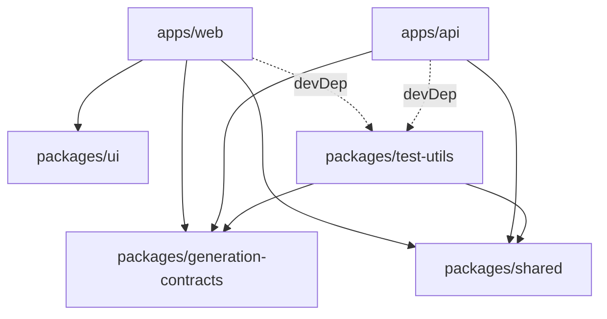
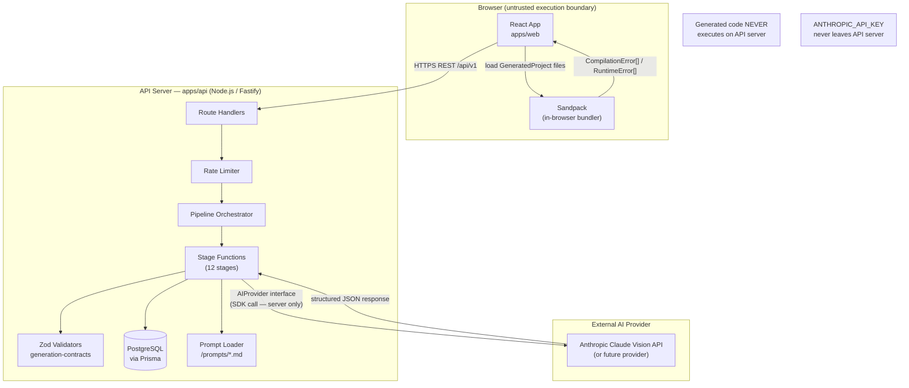
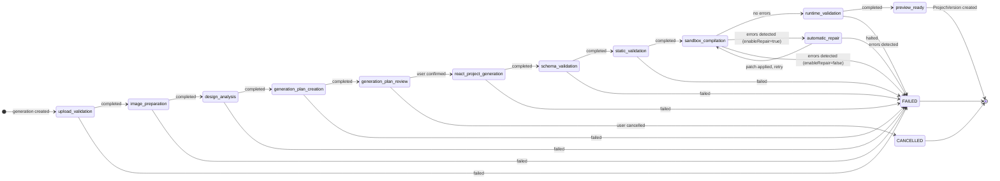
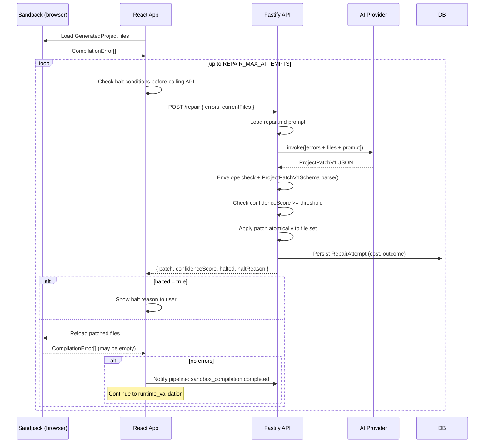
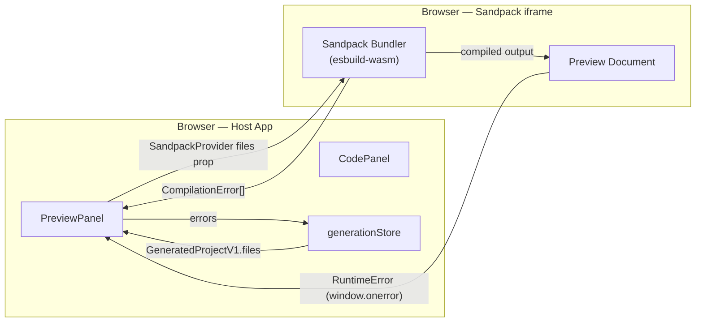

# Design: reactify-foundation

> **Status:** Draft  
> **Derived from:** `requirements.md`  
> **Product:** Reactify — AI-Powered Frontend Engineering Platform  
> **Release:** Foundation (v0.1)

---

## Table of Contents

1. [Overview](#1-overview)
2. [Monorepo Architecture](#2-monorepo-architecture)
3. [Folder Structure](#3-folder-structure)
4. [System Boundary Diagram](#4-system-boundary-diagram)
5. [Database Schema — Prisma](#5-database-schema--prisma)
6. [TypeScript Interfaces and Zod Contracts](#6-typescript-interfaces-and-zod-contracts)
7. [API Endpoints](#7-api-endpoints)
8. [AI Provider Interface](#8-ai-provider-interface)
9. [Generation Pipeline State Machine](#9-generation-pipeline-state-machine)
10. [Repair Pipeline](#10-repair-pipeline)
11. [Sandpack Integration](#11-sandpack-integration)
12. [Frontend Architecture](#12-frontend-architecture)
13. [Security Boundaries](#13-security-boundaries)
14. [Logging Strategy](#14-logging-strategy)
15. [Validation Strategy](#15-validation-strategy)
16. [Testing Strategy](#16-testing-strategy)
17. [Technical Decisions](#17-technical-decisions)

---

## 1. Overview

Reactify converts UI screenshots into production-ready React applications through a structured, validated, multi-stage pipeline. The foundation release ships the complete vertical slice: upload → design analysis → generation plan (user-reviewed) → code generation → sandbox compilation → automatic repair → live preview → versioned export.

The three first-class contracts produced by the pipeline are:

```
Screenshot
    │
    ▼
DesignAnalysisV1      ← Claude analyses layout, components, tokens
    │
    ▼
GenerationPlanV1      ← Claude plans files, components, tokens, strategies
    │  (user reviews and may edit)
    ▼
GeneratedProjectV1    ← Claude generates the React + Tailwind project
    │
    ▼
Sandpack (browser)    ← compiles, renders, surfaces errors
    │
    ▼
ProjectVersion        ← immutable snapshot with parent diff
```

Every AI response is envelope-validated for `schemaVersion` and `responseVersion` before Zod schema validation runs. All three contracts are versioned independently.

---

## 2. Monorepo Architecture

### 2.1 Tooling

| Concern | Tool |
|---|---|
| Monorepo orchestration | Turborepo |
| Package manager | pnpm (workspaces) |
| TypeScript | v5, `strict: true`, project references |
| Linting | ESLint + `@typescript-eslint` |
| Formatting | Prettier |
| Git hooks | Husky + lint-staged |
| CI | GitHub Actions |

### 2.2 Package Dependency Graph



**Rules:**
- `apps/api` MUST NOT import from `apps/web` and vice versa.
- `packages/ui` MUST NOT import from `apps/*`.
- `packages/generation-contracts` MUST NOT import from `apps/*` or `packages/ui`.
- The Anthropic SDK MUST only appear in `apps/api/package.json`.

---

## 3. Folder Structure

```
reactify/
├── apps/
│   ├── web/                          # React + Vite frontend
│   │   ├── src/
│   │   │   ├── app/
│   │   │   │   ├── App.tsx
│   │   │   │   └── router.tsx
│   │   │   ├── pages/
│   │   │   │   ├── HomePage.tsx
│   │   │   │   ├── ProjectPage.tsx
│   │   │   │   └── WorkspacePage.tsx
│   │   │   ├── features/
│   │   │   │   ├── project/
│   │   │   │   │   ├── useProject.ts
│   │   │   │   │   └── projectStore.ts
│   │   │   │   ├── upload/
│   │   │   │   │   ├── UploadZone.tsx
│   │   │   │   │   └── useUpload.ts
│   │   │   │   ├── generation/
│   │   │   │   │   ├── useGeneration.ts
│   │   │   │   │   ├── generationStore.ts
│   │   │   │   │   └── PipelineStatus.tsx
│   │   │   │   ├── plan/
│   │   │   │   │   ├── GenerationPlanReview.tsx
│   │   │   │   │   └── usePlanEditor.ts
│   │   │   │   ├── workspace/
│   │   │   │   │   ├── WorkspaceLayout.tsx
│   │   │   │   │   ├── ScreenshotPanel.tsx
│   │   │   │   │   ├── CodePanel.tsx
│   │   │   │   │   ├── PreviewPanel.tsx
│   │   │   │   │   └── ViewportSwitcher.tsx
│   │   │   │   └── export/
│   │   │   │       └── useExport.ts
│   │   │   ├── lib/
│   │   │   │   ├── api.ts            # fetch wrapper + TanStack Query config
│   │   │   │   └── sandpack.ts       # Sandpack helpers
│   │   │   └── main.tsx
│   │   ├── index.html
│   │   ├── vite.config.ts
│   │   └── package.json
│   │
│   └── api/                          # Fastify backend
│       ├── src/
│       │   ├── server.ts             # Fastify instance + plugin registration
│       │   ├── env.ts                # Zod env validation (startup)
│       │   ├── routes/
│       │   │   ├── health.ts
│       │   │   ├── projects.ts
│       │   │   ├── images.ts
│       │   │   ├── generations.ts
│       │   │   ├── versions.ts
│       │   │   └── export.ts
│       │   ├── pipeline/
│       │   │   ├── index.ts          # orchestrator
│       │   │   ├── stages/
│       │   │   │   ├── uploadValidation.ts
│       │   │   │   ├── imagePreparation.ts
│       │   │   │   ├── designAnalysis.ts
│       │   │   │   ├── generationPlanCreation.ts
│       │   │   │   ├── generationPlanReview.ts
│       │   │   │   ├── reactProjectGeneration.ts
│       │   │   │   ├── schemaValidation.ts
│       │   │   │   ├── staticValidation.ts
│       │   │   │   ├── sandboxCompilation.ts
│       │   │   │   ├── runtimeValidation.ts
│       │   │   │   ├── automaticRepair.ts
│       │   │   │   └── previewReady.ts
│       │   │   └── repair/
│       │   │       ├── repairLoop.ts
│       │   │       └── haltConditions.ts
│       │   ├── providers/
│       │   │   ├── AIProvider.ts     # interface
│       │   │   └── AnthropicProvider.ts
│       │   ├── prompts/
│       │   │   └── loader.ts         # reads /prompts/*.md, extracts front-matter
│       │   ├── lib/
│       │   │   ├── imageValidator.ts # magic bytes check
│       │   │   ├── zipBuilder.ts     # Vite project ZIP
│       │   │   ├── diffEngine.ts     # unified diff for version changedFiles
│       │   │   └── allowlist.ts      # dependency allowlist
│       │   └── db/
│       │       └── client.ts         # Prisma client singleton
│       └── package.json
│
├── packages/
│   ├── generation-contracts/
│   │   ├── src/
│   │   │   ├── design-analysis.ts
│   │   │   ├── generation-plan.ts
│   │   │   ├── generated-project.ts
│   │   │   ├── project-patch.ts
│   │   │   ├── pipeline.ts
│   │   │   └── index.ts
│   │   └── package.json
│   │
│   ├── shared/
│   │   ├── src/
│   │   │   ├── errors.ts             # shared error codes
│   │   │   ├── feature-flags.ts      # flag resolver
│   │   │   └── index.ts
│   │   └── package.json
│   │
│   ├── ui/
│   │   ├── src/
│   │   │   ├── Button.tsx
│   │   │   ├── Badge.tsx
│   │   │   ├── Spinner.tsx
│   │   │   └── index.ts
│   │   └── package.json
│   │
│   └── test-utils/
│       ├── src/
│       │   ├── factories.ts          # test data factories
│       │   ├── MockAIProvider.ts     # deterministic mock
│       │   └── index.ts
│       └── package.json
│
├── prisma/
│   ├── schema.prisma
│   └── migrations/
│
├── prompts/
│   ├── design-analysis.md            # promptVersion + schemaVersion front-matter
│   ├── generation-plan.md
│   ├── generation.md
│   └── repair.md
│
├── docs/
├── .npmrc                            # ignore-scripts=true
├── turbo.json
└── package.json                      # pnpm workspace root
```

---

## 4. System Boundary Diagram



### 4.1 Trust Boundaries

| Boundary | Rule |
|---|---|
| Browser ↔ API | All input validated server-side; client validation is UX-only |
| API ↔ Claude | API key in env var; base64 image never logged; 60 s timeout |
| Sandpack ↔ Host | `<iframe sandbox="allow-scripts">` — no `allow-same-origin` |
| Generated code | Only executes in Sandpack iframe; never on API server |
| Prompts | Loaded from versioned files; content logged at `debug` level only |

---

## 5. Database Schema — Prisma

```prisma
// prisma/schema.prisma

generator client {
  provider = "prisma-client-js"
}

datasource db {
  provider = "postgresql"
  url      = env("DATABASE_URL")
}

// ─── User / Session ──────────────────────────────────────────────────────────

model User {
  id           String    @id @default(uuid())
  email        String?   @unique
  sessionToken String?   @unique
  createdAt    DateTime  @default(now())
  updatedAt    DateTime  @updatedAt
  projects     Project[]
}

// ─── Project ─────────────────────────────────────────────────────────────────

model Project {
  id          String           @id @default(uuid())
  userId      String
  user        User             @relation(fields: [userId], references: [id])
  name        String
  deletedAt   DateTime?
  createdAt   DateTime         @default(now())
  updatedAt   DateTime         @updatedAt
  generations Generation[]
  versions    ProjectVersion[]
}

// ─── Generation ──────────────────────────────────────────────────────────────

model Generation {
  id              String           @id @default(uuid())
  projectId       String
  project         Project          @relation(fields: [projectId], references: [id])
  imageId         String
  imageMimeType   String
  imageSizeBytes  Int

  // User-visible status (maps to UI labels)
  status          GenerationStatus @default(QUEUED)

  // Internal per-stage audit log stored as JSON array of PipelineStageLogEntry
  stageLog        Json             @default("[]")

  // Raw Claude response (stored for audit; never logged in full)
  rawAiResponse   String?

  // AI invocation metadata (REQ-M06)
  promptVersion   String?
  provider        String?
  model           String?
  temperature     Float?
  generationTimestamp DateTime?

  // Cost tracking aggregate (REQ-040)
  inputTokens     Int?
  outputTokens    Int?
  estimatedCostUsd Decimal?        @db.Decimal(10, 6)
  aiLatencyMs     Int?

  // Feature flag snapshot at time of generation (REQ-M09)
  featureFlags    Json?

  createdAt       DateTime         @default(now())
  updatedAt       DateTime         @updatedAt

  designAnalysis  DesignAnalysis?
  generationPlan  GenerationPlan?
  repairAttempts  RepairAttempt[]
  version         ProjectVersion?
}

enum GenerationStatus {
  QUEUED
  UPLOADING
  ANALYZING
  PLANNING
  GENERATING
  VALIDATING
  COMPILING
  REPAIRING
  READY
  FAILED
  CANCELLED
}

// ─── Design Analysis ─────────────────────────────────────────────────────────

model DesignAnalysis {
  id             String     @id @default(uuid())
  generationId   String     @unique
  generation     Generation @relation(fields: [generationId], references: [id])
  schemaVersion  String
  responseVersion String
  analysisJson   Json       // Validated DesignAnalysisV1
  createdAt      DateTime   @default(now())
}

// ─── Generation Plan ─────────────────────────────────────────────────────────

model GenerationPlan {
  id             String     @id @default(uuid())
  generationId   String     @unique
  generation     Generation @relation(fields: [generationId], references: [id])
  schemaVersion  String
  responseVersion String
  planJson       Json       // Validated GenerationPlanV1 (may be user-edited)
  editedByUser   Boolean    @default(false)
  confirmedAt    DateTime?
  createdAt      DateTime   @default(now())
  updatedAt      DateTime   @updatedAt
}

// ─── Project Version ─────────────────────────────────────────────────────────

model ProjectVersion {
  id               String     @id @default(uuid())
  projectId        String
  project          Project    @relation(fields: [projectId], references: [id])
  generationId     String     @unique
  generation       Generation @relation(fields: [generationId], references: [id])
  versionNumber    Int
  parentVersionId  String?    // null for v1
  changeSummary    String
  changedFiles     Json       // VersionedFileDiff[]
  projectSnapshot  Json       // GeneratedProjectV1
  analysisSnapshot Json       // DesignAnalysisV1
  planSnapshot     Json       // GenerationPlanV1
  // AI metadata snapshot for reproducibility
  promptVersion    String?
  provider         String?
  model            String?
  temperature      Float?
  createdAt        DateTime   @default(now())

  @@unique([projectId, versionNumber])
}

// ─── Repair Attempt ──────────────────────────────────────────────────────────

model RepairAttempt {
  id            String     @id @default(uuid())
  generationId  String
  generation    Generation @relation(fields: [generationId], references: [id])
  attemptNumber Int
  errorInput    String     // JSON-serialised CompilationError[]
  repairPrompt  String
  confidenceScore Float?
  patchJson     Json?      // ProjectPatchV1 returned by AI (null if rejected)
  outcome       RepairOutcome
  haltReason    String?    // REPAIR_EXHAUSTED | REPAIR_LOOP_DETECTED | REPAIR_LOW_CONFIDENCE
  // Per-call cost tracking (REQ-040a)
  inputTokens   Int?
  outputTokens  Int?
  estimatedCostUsd Decimal? @db.Decimal(10, 6)
  aiLatencyMs   Int?
  createdAt     DateTime   @default(now())
}

enum RepairOutcome {
  SUCCESS
  FAILED
  HALTED
}
```

---

## 6. TypeScript Interfaces and Zod Contracts

All contracts live in `packages/generation-contracts/src/`. They are imported by both `apps/web` and `apps/api`. No app-layer code defines its own contract types.

### 6.1 Shared Envelope

Every AI response must carry this envelope **before** any contract-specific validation:

```typescript
// packages/generation-contracts/src/envelope.ts
import { z } from "zod";

export const AIResponseEnvelopeSchema = z.object({
  schemaVersion: z.string(),
  responseVersion: z.string(),
});
export type AIResponseEnvelope = z.infer<typeof AIResponseEnvelopeSchema>;
```

The pipeline validates the envelope first. If either field is absent, it throws
`AI_RESPONSE_VERSION_MISSING` without attempting further parsing (REQ-M07).

### 6.2 Design Analysis — `DesignAnalysisV1`

```typescript
// packages/generation-contracts/src/design-analysis.ts
import { z } from "zod";

export const ColorTokenSchema = z.object({
  name: z.string(),
  hex: z.string().regex(/^#[0-9a-fA-F]{6}$/),
  usage: z.string().optional(),
});

export const TypographyTokenSchema = z.object({
  element: z.string(),
  fontFamily: z.string(),
  fontSize: z.string(),
  fontWeight: z.string(),
  lineHeight: z.string().optional(),
  letterSpacing: z.string().optional(),
});

export const SpacingTokenSchema = z.object({
  name: z.string(),
  value: z.string(),
});

export interface ComponentNode {
  id: string;
  type: string;
  description: string;
  props?: Record<string, unknown>;
  children?: ComponentNode[];
  interactions?: string[];
  responsive?: string;
}

export const ComponentNodeSchema: z.ZodType<ComponentNode> = z.lazy(() =>
  z.object({
    id: z.string(),
    type: z.string(),
    description: z.string(),
    props: z.record(z.unknown()).optional(),
    children: z.array(ComponentNodeSchema).optional(),
    interactions: z.array(z.string()).optional(),
    responsive: z.string().optional(),
  })
);

export const DesignAnalysisV1Schema = z.object({
  schemaVersion: z.literal("1"),
  responseVersion: z.string(),
  layoutHierarchy: z.string(),
  componentHierarchy: z.array(ComponentNodeSchema),
  colors: z.array(ColorTokenSchema),
  typography: z.array(TypographyTokenSchema),
  spacing: z.array(SpacingTokenSchema),
  borders: z.string().optional(),
  shadows: z.string().optional(),
  icons: z.array(z.string()).optional(),
  imagePlaceholders: z.array(z.string()).optional(),
  interactions: z.array(z.string()).optional(),
  responsiveBehavior: z.string().optional(),
});

export type DesignAnalysisV1 = z.infer<typeof DesignAnalysisV1Schema>;
```

### 6.3 Generation Plan — `GenerationPlanV1`

```typescript
// packages/generation-contracts/src/generation-plan.ts
import { z } from "zod";

export const PlannedPropSchema = z.object({
  name: z.string(),
  type: z.string(),
  required: z.boolean(),
  description: z.string(),
});

export const PlannedComponentSchema = z.object({
  name: z.string(),                         // PascalCase
  type: z.string(),                         // e.g. "layout", "ui", "page"
  purpose: z.string(),
  props: z.array(PlannedPropSchema),
  children: z.boolean(),
  dependencies: z.array(z.string()),        // other component names
  accessibilityNotes: z.string(),
});

export const PlannedFileSchema = z.object({
  path: z.string(),
  language: z.enum(["tsx", "ts", "css", "json", "html", "js"]),
  purpose: z.string(),
  components: z.array(z.string()),          // component names in this file
});

export const DesignTokensSchema = z.object({
  colors: z.record(z.string()),             // token name -> hex
  typography: z.record(z.string()),         // token name -> value
  spacing: z.record(z.string()),
  borderRadius: z.record(z.string()).optional(),
  shadows: z.record(z.string()).optional(),
});

export const GenerationPlanV1Schema = z.object({
  schemaVersion: z.literal("1"),
  responseVersion: z.string(),
  components: z.array(PlannedComponentSchema).min(1),
  files: z.array(PlannedFileSchema).min(1),
  designTokens: DesignTokensSchema,
  dependencies: z.record(z.string()),       // package -> version
  devDependencies: z.record(z.string()).optional(),
  responsiveStrategy: z.string(),
  accessibilityStrategy: z.string(),
  confidenceWarnings: z.array(z.string()),
});

export type GenerationPlanV1 = z.infer<typeof GenerationPlanV1Schema>;
export type PlannedComponent = z.infer<typeof PlannedComponentSchema>;
```

### 6.4 Generated Project — `GeneratedProjectV1`

```typescript
// packages/generation-contracts/src/generated-project.ts
import { z } from "zod";

const SAFE_PATH_RE = /^[a-zA-Z0-9_\-./]+$/;

export const PropDefinitionSchema = z.object({
  name: z.string(),
  type: z.string(),
  required: z.boolean(),
  description: z.string(),
});

export const ComponentMetadataSchema = z.object({
  name: z.string(),
  purpose: z.string(),
  props: z.array(PropDefinitionSchema),
  children: z.boolean(),
  dependencies: z.array(z.string()),
  accessibilityNotes: z.string(),
});

export const GeneratedFileSchema = z.object({
  path: z.string()
    .regex(SAFE_PATH_RE, "Unsafe characters in path")
    .refine((p) => !p.startsWith("/"), "No absolute paths")
    .refine((p) => !p.includes("../"), "No directory traversal"),
  language: z.enum(["tsx", "ts", "css", "json", "html", "js"]),
  content: z.string().min(1),
  purpose: z.string(),
  componentMetadata: ComponentMetadataSchema.optional(),
});

export const GeneratedProjectV1Schema = z.object({
  schemaVersion: z.literal("1"),
  responseVersion: z.string(),
  projectName: z.string(),
  summary: z.string(),
  generationPlanRef: z.string().uuid().optional(),
  designAnalysisRef: z.string().uuid().optional(),
  dependencies: z.record(z.string()),
  devDependencies: z.record(z.string()).optional(),
  files: z.array(GeneratedFileSchema).min(1),
  entryFile: z.string(),
  warnings: z.array(z.string()),
});

export type GeneratedFile = z.infer<typeof GeneratedFileSchema>;
export type GeneratedProjectV1 = z.infer<typeof GeneratedProjectV1Schema>;
export type ComponentMetadata = z.infer<typeof ComponentMetadataSchema>;
```

### 6.5 Project Patch — `ProjectPatchV1`

```typescript
// packages/generation-contracts/src/project-patch.ts
import { z } from "zod";
import { GeneratedFileSchema } from "./generated-project";

const SAFE_PATH_RE = /^[a-zA-Z0-9_\-./]+$/;

const safePath = z.string()
  .regex(SAFE_PATH_RE)
  .refine((p) => !p.startsWith("/"))
  .refine((p) => !p.includes("../"));

export const AddFileOperationSchema = z.object({
  type: z.literal("ADD_FILE"),
  file: GeneratedFileSchema,
});

export const UpdateFileOperationSchema = z.object({
  type: z.literal("UPDATE_FILE"),
  path: safePath,
  content: z.string().min(1),
});

export const DeleteFileOperationSchema = z.object({
  type: z.literal("DELETE_FILE"),
  path: safePath,
});

export const UpdateDependencyOperationSchema = z.object({
  type: z.literal("UPDATE_DEPENDENCY"),
  package: z.string().min(1),
  version: z.string().optional(),   // omit to remove
  dev: z.boolean().default(false),
});

export const PatchOperationSchema = z.discriminatedUnion("type", [
  AddFileOperationSchema,
  UpdateFileOperationSchema,
  DeleteFileOperationSchema,
  UpdateDependencyOperationSchema,
]);

export const ProjectPatchV1Schema = z.object({
  schemaVersion: z.literal("1"),
  responseVersion: z.string(),
  confidenceScore: z.number().min(0).max(1),
  operations: z.array(PatchOperationSchema).min(1),
  rationale: z.string(),
});

export type ProjectPatchV1 = z.infer<typeof ProjectPatchV1Schema>;
export type PatchOperation = z.infer<typeof PatchOperationSchema>;
```

### 6.6 Pipeline Stage Contract

```typescript
// packages/generation-contracts/src/pipeline.ts
import { z } from "zod";

export const PipelineStageNameSchema = z.enum([
  "upload_validation",
  "image_preparation",
  "design_analysis",
  "generation_plan_creation",
  "generation_plan_review",
  "react_project_generation",
  "schema_validation",
  "static_validation",
  "sandbox_compilation",
  "runtime_validation",
  "automatic_repair",
  "preview_ready",
]);

export const PipelineStageStatusSchema = z.enum([
  "pending", "running", "completed", "failed", "skipped", "cancelled",
]);

export const PipelineStageLogEntrySchema = z.object({
  stage: PipelineStageNameSchema,
  status: PipelineStageStatusSchema,
  startedAt: z.string().datetime().optional(),
  completedAt: z.string().datetime().optional(),
  durationMs: z.number().optional(),
  errorCode: z.string().optional(),
  errorMessage: z.string().optional(),
});

export type PipelineStageName   = z.infer<typeof PipelineStageNameSchema>;
export type PipelineStageStatus = z.infer<typeof PipelineStageStatusSchema>;
export type PipelineStageLogEntry = z.infer<typeof PipelineStageLogEntrySchema>;
```

### 6.7 Shared Pipeline Stage Function Interface

```typescript
// packages/shared/src/pipeline-types.ts
import type { PrismaClient } from "@prisma/client";
import type { PipelineStageName } from "@reactify/generation-contracts";

export interface PipelineLogger {
  info(msg: string, meta?: Record<string, unknown>): void;
  warn(msg: string, meta?: Record<string, unknown>): void;
  error(msg: string, meta?: Record<string, unknown>): void;
}

export interface StageContext {
  generationId: string;
  projectId: string;
  logger: PipelineLogger;
  db: PrismaClient;
  flags: FeatureFlags;
}

export interface FeatureFlags {
  enableRepair: boolean;
  enableInspector: boolean;
  enableAccessibility: boolean;
  enableGenerationPlanEditing: boolean;
}

export interface StageResult<T = unknown> {
  status: "completed" | "failed" | "skipped";
  output?: T;
  errorCode?: string;
  errorMessage?: string;
  durationMs: number;
}

export type StageFunction<TInput, TOutput> = (
  input: TInput,
  ctx: StageContext,
) => Promise<StageResult<TOutput>>;
```

### 6.8 Error Taxonomy

```typescript
// packages/shared/src/errors.ts
export const ErrorCode = {
  // Upload
  INVALID_MIME_TYPE: "INVALID_MIME_TYPE",
  FILE_TOO_LARGE: "FILE_TOO_LARGE",
  IMAGE_NOT_FOUND: "IMAGE_NOT_FOUND",
  // AI response
  AI_RESPONSE_VERSION_MISSING: "AI_RESPONSE_VERSION_MISSING",
  ANALYSIS_SCHEMA_INVALID: "ANALYSIS_SCHEMA_INVALID",
  PLAN_SCHEMA_INVALID: "PLAN_SCHEMA_INVALID",
  GENERATION_SCHEMA_INVALID: "GENERATION_SCHEMA_INVALID",
  AI_TIMEOUT: "AI_TIMEOUT",
  AI_ERROR: "AI_ERROR",
  // Patch
  PATCH_SCHEMA_INVALID: "PATCH_SCHEMA_INVALID",
  PATCH_APPLY_FAILED: "PATCH_APPLY_FAILED",
  // Validation
  UNSAFE_DEPENDENCY: "UNSAFE_DEPENDENCY",
  UNSAFE_PATH: "UNSAFE_PATH",
  COMPONENT_METADATA_INVALID: "COMPONENT_METADATA_INVALID",
  // Repair
  REPAIR_EXHAUSTED: "REPAIR_EXHAUSTED",
  REPAIR_LOOP_DETECTED: "REPAIR_LOOP_DETECTED",
  REPAIR_LOW_CONFIDENCE: "REPAIR_LOW_CONFIDENCE",
  // Project / version
  PROJECT_NOT_FOUND: "PROJECT_NOT_FOUND",
  VERSION_NOT_FOUND: "VERSION_NOT_FOUND",
  GENERATION_NOT_FOUND: "GENERATION_NOT_FOUND",
  // Auth / rate
  RATE_LIMIT_EXCEEDED: "RATE_LIMIT_EXCEEDED",
  // Internal
  INTERNAL_ERROR: "INTERNAL_ERROR",
} as const;

export type ErrorCode = (typeof ErrorCode)[keyof typeof ErrorCode];

export interface APIError {
  error: {
    code: ErrorCode;
    message: string;
    requestId: string;
    fieldErrors?: Record<string, string>;  // for validation errors
  };
}
```

### 6.9 Environment Variables Schema

```typescript
// apps/api/src/env.ts
import { z } from "zod";

const EnvSchema = z.object({
  DATABASE_URL:        z.string().url(),
  ANTHROPIC_API_KEY:   z.string().min(1),
  ALLOWED_ORIGINS:     z.string().min(1),   // comma-separated
  PORT:                z.coerce.number().default(3001),
  IMAGE_MAX_BYTES:     z.coerce.number().default(10_485_760),
  RATE_LIMIT_RPM:      z.coerce.number().default(10),
  AI_TIMEOUT_MS:       z.coerce.number().default(60_000),
  REPAIR_MAX_ATTEMPTS: z.coerce.number().default(3),
  REPAIR_CONFIDENCE_THRESHOLD: z.coerce.number().default(0.4),
  // Feature flags
  ENABLE_REPAIR:                z.coerce.boolean().default(true),
  ENABLE_INSPECTOR:             z.coerce.boolean().default(true),
  ENABLE_ACCESSIBILITY:         z.coerce.boolean().default(true),
  ENABLE_GENERATION_PLAN_EDITING: z.coerce.boolean().default(true),
  NODE_ENV: z.enum(["development", "test", "production"]).default("development"),
});

export type Env = z.infer<typeof EnvSchema>;

export function validateEnv(): Env {
  const result = EnvSchema.safeParse(process.env);
  if (!result.success) {
    console.error("Invalid environment variables:", result.error.format());
    process.exit(1);
  }
  return result.data;
}
```

---

## 7. API Endpoints

Base URL: `/api/v1`  
All endpoints return `application/json`. Errors use the `APIError` shape from §6.8.  
All responses include `X-Request-Id` header.

### 7.1 Health

#### `GET /health`
No auth required.

**Response 200:**
```json
{
  "status": "ok",
  "version": "0.1.0",
  "timestamp": "2025-01-01T00:00:00.000Z"
}
```

---

### 7.2 Projects

#### `POST /projects`
Create a new project.

**Request:**
```json
{ "name": "My Dashboard UI" }
```

**Response 201:**
```json
{
  "id": "uuid",
  "name": "My Dashboard UI",
  "createdAt": "2025-01-01T00:00:00.000Z",
  "updatedAt": "2025-01-01T00:00:00.000Z"
}
```

**Errors:** `422` name too short/long.

---

#### `GET /projects?page=1&limit=20`
List projects for the current user, sorted by `updatedAt` desc.

**Response 200:**
```json
{
  "items": [{ "id": "uuid", "name": "...", "updatedAt": "..." }],
  "total": 42,
  "page": 1,
  "limit": 20
}
```

---

#### `GET /projects/:projectId`

**Response 200:** Full project object with `generationCount` and `versionCount`.

**Errors:** `404 PROJECT_NOT_FOUND`

---

#### `DELETE /projects/:projectId`
Soft-delete the project and cascade to child records.

**Response 204:** No body.

---

### 7.3 Image Upload

#### `POST /projects/:projectId/images`
Content-Type: `multipart/form-data`, field name `image`.

**Response 201:**
```json
{
  "imageId": "uuid",
  "mimeType": "image/png",
  "sizeBytes": 204800,
  "previewUrl": "/api/v1/images/uuid/preview"
}
```

**Errors:**

| Status | Code | Trigger |
|--------|------|---------|
| 422 | `INVALID_MIME_TYPE` | Not PNG/JPEG/WebP (magic bytes) |
| 422 | `FILE_TOO_LARGE` | Exceeds `IMAGE_MAX_BYTES` |
| 429 | `RATE_LIMIT_EXCEEDED` | Over RPM limit |

---

#### `GET /images/:imageId/preview`
Returns the image binary with its original MIME type. Used by `` in the frontend.

---

### 7.4 Generations

#### `POST /projects/:projectId/generations`
Start a new generation.

**Request:**
```json
{ "imageId": "uuid" }
```

**Response 202:**
```json
{
  "generationId": "uuid",
  "status": "Queued"
}
```

**Errors:** `404 IMAGE_NOT_FOUND`, `429 RATE_LIMIT_EXCEEDED`

---

#### `GET /projects/:projectId/generations/:generationId`
Poll generation status. Frontend polls every 2 s while status is not terminal.

**Response 200:**
```json
{
  "id": "uuid",
  "status": "Analyzing",
  "stages": [
    { "stage": "upload_validation",  "status": "completed", "durationMs": 18 },
    { "stage": "image_preparation",  "status": "completed", "durationMs": 42 },
    { "stage": "design_analysis",    "status": "running",   "startedAt": "..." }
  ],
  "designAnalysis": null,
  "generationPlan": null,
  "generatedProject": null,
  "repairAttempts": [],
  "cost": {
    "inputTokens": null,
    "outputTokens": null,
    "estimatedCostUsd": null,
    "aiLatencyMs": null
  },
  "errors": []
}
```

When `status` is `Planning` and `generationPlan` is populated, the frontend presents the plan for user review before confirming.

---

#### `POST /projects/:projectId/generations/:generationId/confirm-plan`
User confirms (or submits edits to) the `GenerationPlan`, unblocking stage 6.

**Request:**
```json
{
  "plan": { /* GenerationPlanV1 — may be the original or edited */ }
}
```

**Response 200:**
```json
{ "status": "Generating" }
```

**Errors:** `422 PLAN_SCHEMA_INVALID` (with `fieldErrors`), `409` if generation is not in `Planning` status.

---

#### `DELETE /projects/:projectId/generations/:generationId`
Cancel an in-progress generation.

**Response 200:**
```json
{ "status": "Cancelled" }
```

---

### 7.5 Project Versions

#### `GET /projects/:projectId/versions`

**Response 200:**
```json
{
  "items": [
    {
      "id": "uuid",
      "versionNumber": 3,
      "parentVersionId": "uuid",
      "changeSummary": "Repaired 2 compilation errors",
      "changedFiles": { "added": 0, "modified": 2, "deleted": 0 },
      "createdAt": "..."
    }
  ]
}
```

Note: `changedFiles` in the list response is a summary count object, not the full diff array, to keep responses small.

---

#### `GET /projects/:projectId/versions/:versionId`
Load a full version including snapshots.

**Response 200:**
```json
{
  "id": "uuid",
  "versionNumber": 3,
  "parentVersionId": "uuid",
  "changeSummary": "Repaired 2 compilation errors",
  "changedFiles": [
    { "path": "src/Button.tsx", "changeType": "modified", "diff": "@@..." }
  ],
  "projectSnapshot": { /* GeneratedProjectV1 */ },
  "analysisSnapshot": { /* DesignAnalysisV1 */ },
  "planSnapshot": { /* GenerationPlanV1 */ },
  "promptVersion": "1.2.0",
  "provider": "anthropic",
  "model": "claude-3-5-sonnet-20241022",
  "createdAt": "..."
}
```

**Errors:** `404 VERSION_NOT_FOUND`

---

### 7.6 Export

#### `GET /projects/:projectId/versions/:versionId/export`
Build and stream a Vite React TypeScript ZIP.

**Response 200:**
- Content-Type: `application/zip`
- Content-Disposition: `attachment; filename="<projectName>-v<n>.zip"`

ZIP contents:
```
<projectName>/
  package.json
  vite.config.ts
  tsconfig.json
  tsconfig.node.json
  index.html
  tailwind.config.js
  postcss.config.js
  src/
    <all generated source files>
```

**Errors:** `404 VERSION_NOT_FOUND`

---

### 7.7 Repair (Internal — called by frontend after Sandpack reports errors)

#### `POST /projects/:projectId/generations/:generationId/repair`
Frontend calls this when Sandpack reports compilation errors and `enableRepair` flag is on.

**Request:**
```json
{
  "errors": [
    { "message": "Cannot find module 'lucide-react'", "file": "src/Icon.tsx", "line": 3 }
  ],
  "currentFiles": { "src/Icon.tsx": "import { ... } from 'lucide-react'..." }
}
```

**Response 200:**
```json
{
  "attemptNumber": 1,
  "patch": { /* ProjectPatchV1 */ },
  "confidenceScore": 0.85,
  "halted": false,
  "haltReason": null
}
```

**Response 200 (halted):**
```json
{
  "attemptNumber": 2,
  "patch": null,
  "confidenceScore": 0.31,
  "halted": true,
  "haltReason": "REPAIR_LOW_CONFIDENCE"
}
```

---

### 7.8 Route Summary Table

| Method | Path | Auth | Description |
|--------|------|------|-------------|
| GET | `/health` | None | Liveness |
| POST | `/projects` | Session | Create project |
| GET | `/projects` | Session | List projects |
| GET | `/projects/:id` | Session | Get project |
| DELETE | `/projects/:id` | Session | Delete project |
| POST | `/projects/:id/images` | Session | Upload screenshot |
| GET | `/images/:imageId/preview` | Session | Serve image |
| POST | `/projects/:id/generations` | Session | Start generation |
| GET | `/projects/:id/generations/:gid` | Session | Poll status |
| POST | `/projects/:id/generations/:gid/confirm-plan` | Session | Confirm/edit plan |
| DELETE | `/projects/:id/generations/:gid` | Session | Cancel generation |
| POST | `/projects/:id/generations/:gid/repair` | Session | Request repair |
| GET | `/projects/:id/versions` | Session | List versions |
| GET | `/projects/:id/versions/:vid` | Session | Load version |
| GET | `/projects/:id/versions/:vid/export` | Session | Download ZIP |

---

## 8. AI Provider Interface

### 8.1 Interface Definition

```typescript
// apps/api/src/providers/AIProvider.ts

export interface AIInvocationOptions {
  promptVersion: string;       // from prompt file front-matter
  model: string;
  temperature: number;
  maxTokens?: number;
  timeoutMs: number;
}

export interface AIImageInput {
  base64: string;
  mimeType: "image/png" | "image/jpeg" | "image/webp";
}

export interface AITextInput {
  text: string;
}

export type AIInput = AIImageInput | AITextInput;

export interface AIInvocationResult {
  rawText: string;             // unparsed response text
  inputTokens: number;
  outputTokens: number;
  latencyMs: number;
  model: string;
  provider: string;
}

export interface AIProvider {
  readonly providerName: string;   // e.g. "anthropic"
  readonly defaultModel: string;

  /**
   * Send one or more inputs (image + text, or text only) and
   * receive a raw text response. All parsing and validation is
   * handled by the caller — the provider is only responsible for
   * transport and token accounting.
   */
  invoke(
    inputs: AIInput[],
    options: AIInvocationOptions,
  ): Promise<AIInvocationResult>;
}
```

### 8.2 Anthropic Implementation

```typescript
// apps/api/src/providers/AnthropicProvider.ts

import Anthropic from "@anthropic-ai/sdk";
import type { AIProvider, AIInput, AIInvocationOptions, AIInvocationResult } from "./AIProvider";

export class AnthropicProvider implements AIProvider {
  readonly providerName = "anthropic";
  readonly defaultModel = "claude-3-5-sonnet-20241022";

  private client: Anthropic;

  constructor(apiKey: string) {
    this.client = new Anthropic({ apiKey });
  }

  async invoke(inputs: AIInput[], options: AIInvocationOptions): Promise<AIInvocationResult> {
    const start = Date.now();

    const content = inputs.map((input) => {
      if ("base64" in input) {
        return {
          type: "image" as const,
          source: { type: "base64" as const, media_type: input.mimeType, data: input.base64 },
        };
      }
      return { type: "text" as const, text: input.text };
    });

    const response = await this.client.messages.create(
      {
        model: options.model,
        max_tokens: options.maxTokens ?? 8192,
        temperature: options.temperature,
        messages: [{ role: "user", content }],
      },
      { timeout: options.timeoutMs },
    );

    const rawText = response.content
      .filter((b) => b.type === "text")
      .map((b) => (b as { type: "text"; text: string }).text)
      .join("");

    return {
      rawText,
      inputTokens: response.usage.input_tokens,
      outputTokens: response.usage.output_tokens,
      latencyMs: Date.now() - start,
      model: response.model,
      provider: this.providerName,
    };
  }
}
```

### 8.3 Mock Implementation (test-utils)

```typescript
// packages/test-utils/src/MockAIProvider.ts

import type { AIProvider, AIInput, AIInvocationOptions, AIInvocationResult } from "../../apps/api/src/providers/AIProvider";

export class MockAIProvider implements AIProvider {
  readonly providerName = "mock";
  readonly defaultModel = "mock-model-v1";

  private fixture: string;

  constructor(fixture: string) {
    // fixture is the raw JSON string the mock will return
    this.fixture = fixture;
  }

  async invoke(_inputs: AIInput[], _options: AIInvocationOptions): Promise<AIInvocationResult> {
    return {
      rawText: this.fixture,
      inputTokens: 100,
      outputTokens: 500,
      latencyMs: 50,
      model: this.defaultModel,
      provider: this.providerName,
    };
  }
}
```

### 8.4 Prompt Loading

```typescript
// apps/api/src/prompts/loader.ts

import { readFileSync } from "fs";
import { join } from "path";
import matter from "gray-matter";   // front-matter parser

export interface PromptMeta {
  promptVersion: string;
  schemaVersion: string;
}

export interface LoadedPrompt {
  meta: PromptMeta;
  content: string;
}

const PROMPTS_DIR = join(process.cwd(), "prompts");

export function loadPrompt(name: "design-analysis" | "generation-plan" | "generation" | "repair"): LoadedPrompt {
  const raw = readFileSync(join(PROMPTS_DIR, `${name}.md`), "utf-8");
  const { data, content } = matter(raw);
  return {
    meta: {
      promptVersion: String(data.promptVersion),
      schemaVersion: String(data.schemaVersion),
    },
    content: content.trim(),
  };
}
```

### 8.5 Adding a Future Provider

To add OpenAI, Gemini, or any other provider:
1. Create `apps/api/src/providers/OpenAIProvider.ts` implementing `AIProvider`.
2. Register it in the provider factory (a simple map from `process.env.AI_PROVIDER` → instance).
3. No pipeline stage code, route handler, or Zod contract changes are required.

---

## 9. Generation Pipeline State Machine

### 9.1 Stage Sequence and Status Transitions



### 9.2 User-Visible Status Derivation

| Active Stage | Internal Status | User-Visible Status |
|---|---|---|
| — | — | `Queued` |
| `upload_validation` | running | `Uploading` |
| `image_preparation` | running | `Uploading` |
| `design_analysis` | running | `Analyzing` |
| `generation_plan_creation` | running | `Planning` |
| `generation_plan_review` | running | `Planning` |
| `react_project_generation` | running | `Generating` |
| `schema_validation` | running | `Validating` |
| `static_validation` | running | `Validating` |
| `sandbox_compilation` | running | `Compiling` |
| `runtime_validation` | running | `Compiling` |
| `automatic_repair` | running | `Repairing` |
| `preview_ready` | completed | `Ready` |
| Any | failed | `Failed` |
| Any | cancelled | `Cancelled` |

### 9.3 Pipeline Orchestrator Design

The orchestrator runs each stage function in order, persisting stage log entries to the DB before and after each call. It never throws — unhandled errors inside a stage are caught and converted to a `failed` result.

```
runPipeline(generationId):
  for each stage in STAGE_ORDER:
    if flags disable this stage → mark skipped, continue
    persist { stage, status: "running", startedAt }
    result = await stageFunction(previousOutput, ctx)
    persist { stage, status: result.status, completedAt, durationMs, errorCode? }
    if result.status === "failed":
      update Generation.status = FAILED
      return
    if stage === "generation_plan_review":
      update Generation.status = PLANNING
      return   ← orchestrator exits; resumes when confirm-plan endpoint is called
  update Generation.status = READY
```

### 9.4 Full Sequence — Upload to Preview Ready

```mermaid
sequenceDiagram
    actor User
    participant Web  as React App (browser)
    participant API  as Fastify API
    participant DB   as PostgreSQL
    participant AI   as AI Provider (Claude)
    participant SP   as Sandpack (browser)

    User->>Web: Drops image file
    Web->>Web: Client MIME + size pre-check (UX only)
    Web->>API: POST /projects/:id/images (multipart)
    API->>API: Magic bytes + size validation
    API->>DB: Store image metadata
    API-->>Web: { imageId, previewUrl }
    Web-->>User: Shows image preview

    User->>Web: Clicks "Generate"
    Web->>API: POST /generations { imageId }
    API->>DB: Create Generation (QUEUED)
    API-->>Web: { generationId }
    Web->>Web: Start polling every 2s

    Note over API: Stage 1–2: upload_validation, image_preparation
    API->>API: Validate image, encode base64 in memory
    API->>DB: Log stages completed

    Note over API: Stage 3: design_analysis
    API->>AI: invoke([image, prompt], designAnalysisOptions)
    AI-->>API: Raw JSON text
    API->>API: Envelope check (schemaVersion, responseVersion)
    API->>API: DesignAnalysisV1Schema.parse()
    API->>DB: Store DesignAnalysis, update cost fields
    API->>DB: Log stage completed

    Note over API: Stage 4: generation_plan_creation
    API->>AI: invoke([analysisJson, prompt], planOptions)
    AI-->>API: Raw JSON text
    API->>API: Envelope check + GenerationPlanV1Schema.parse()
    API->>DB: Store GenerationPlan, update cost fields
    API->>DB: Log stage completed

    Note over API: Stage 5: generation_plan_review (user gate)
    API->>DB: Update Generation.status = PLANNING
    Web->>Web: Poll returns status=Planning + generationPlan
    Web-->>User: Shows GenerationPlan review UI

    User->>Web: (optionally edits plan) clicks Confirm
    Web->>API: POST /generations/:id/confirm-plan { plan }
    API->>API: GenerationPlanV1Schema.parse(editedPlan)
    API->>DB: Update GenerationPlan.editedByUser, confirmedAt
    API->>API: Resume pipeline from stage 6
    API-->>Web: { status: "Generating" }

    Note over API: Stage 6: react_project_generation
    API->>AI: invoke([planJson, prompt], generationOptions)
    AI-->>API: Raw JSON text
    API->>API: Envelope check + GeneratedProjectV1Schema.parse()
    API->>DB: Update cost fields
    API->>DB: Log stage completed

    Note over API: Stages 7–8: schema_validation, static_validation
    API->>API: Allowlist + path safety checks, component metadata check
    API->>DB: Log stages completed

    Web->>Web: Poll returns generatedProject
    Web->>SP: Load GeneratedProject.files into Sandpack

    Note over SP: Stage 9: sandbox_compilation
    SP->>SP: Bundle files
    SP-->>Web: CompilationError[] (if any)
    Web->>Web: If errors → POST /repair; else mark runtime_validation

    Note over SP: Stage 10: runtime_validation
    SP-->>Web: RuntimeError[] (if any, after initial render)

    Note over API: Stage 12: preview_ready
    API->>DB: Create ProjectVersion (with parent diff)
    API->>DB: Update Generation.status = READY
    Web->>Web: Poll returns status=Ready
    Web-->>User: Live preview visible
```

---

## 10. Repair Pipeline

### 10.1 Repair Loop Design

The repair loop is driven by the **browser** — Sandpack runs client-side, so only the frontend can observe compilation errors. The frontend calls `POST /repair`, receives a `ProjectPatchV1`, applies it to the in-memory file set, and reloads Sandpack.



### 10.2 Halt Conditions

Evaluated in this priority order before each repair call:

```
1. REPAIR_LOOP_DETECTED
   errors[N] === errors[N-1]  (same codes + files + lines)
   → halt immediately, do not call AI

2. REPAIR_MAX_ATTEMPTS reached
   attemptNumber >= REPAIR_MAX_ATTEMPTS
   → halt immediately, do not call AI

3. REPAIR_LOW_CONFIDENCE
   AI returns confidenceScore < REPAIR_CONFIDENCE_THRESHOLD
   → halt after receiving AI response, do not apply patch
```

### 10.3 Patch Application (Atomic)

```
applyPatch(currentFiles, patch):
  validate patch against ProjectPatchV1Schema
  snapshot = deepCopy(currentFiles)
  try:
    for each operation in patch.operations:
      switch operation.type:
        ADD_FILE:    assert path not in currentFiles; currentFiles[path] = file
        UPDATE_FILE: assert path in currentFiles; currentFiles[path] = content
        DELETE_FILE: assert path in currentFiles; delete currentFiles[path]
        UPDATE_DEPENDENCY: validate against allowlist; update dependencies
  catch error:
    currentFiles = snapshot   ← rollback
    throw PatchApplyError(operation.index, error)
  return currentFiles
```

---

## 11. Sandpack Integration

### 11.1 Architecture

Sandpack runs entirely in the browser inside a sandboxed `<iframe>`. The host React app communicates with Sandpack via the `@codesandbox/sandpack-react` component API. No generated code ever touches the API server.



### 11.2 File Map Conversion

`GeneratedProjectV1.files[]` is converted to Sandpack's `SandpackFiles` format before loading:

```typescript
// apps/web/src/lib/sandpack.ts

import type { SandpackFiles } from "@codesandbox/sandpack-react";
import type { GeneratedProjectV1 } from "@reactify/generation-contracts";

export function toSandpackFiles(project: GeneratedProjectV1): SandpackFiles {
  return Object.fromEntries(
    project.files.map((f) => [
      f.path.startsWith("/") ? f.path : `/${f.path}`,
      { code: f.content, readOnly: false },
    ])
  );
}

export function toSandpackDependencies(project: GeneratedProjectV1): Record<string, string> {
  return {
    react: "^18.0.0",
    "react-dom": "^18.0.0",
    ...project.dependencies,
  };
}
```

### 11.3 Error Capture

```typescript
// apps/web/src/features/generation/useSandpackErrors.ts

import { useSandpack } from "@codesandbox/sandpack-react";
import { useEffect } from "react";
import { useGenerationStore } from "./generationStore";

export function useSandpackErrors() {
  const { listen } = useSandpack();
  const addError = useGenerationStore((s) => s.addSandpackError);

  useEffect(() => {
    const unsub = listen((msg) => {
      if (msg.type === "action" && msg.action === "show-error") {
        addError({
          type: "compilation",
          message: msg.message ?? "",
          file: msg.path ?? null,
          line: msg.line ?? null,
        });
      }
      if (msg.type === "unhandled-error") {
        addError({
          type: "runtime",
          message: msg.message ?? "",
          stack: msg.stack ?? null,
          file: null,
          line: null,
        });
      }
    });
    return unsub;
  }, [listen, addError]);
}
```

### 11.4 Viewport Resizing

The preview panel wraps the Sandpack `<SandpackPreview>` in a container that constrains width:

```typescript
const VIEWPORT_WIDTHS = {
  desktop: 1280,
  tablet: 768,
  mobile: 375,
} as const;

// PreviewPanel renders:
// <div style={{ width: VIEWPORT_WIDTHS[viewport], transition: "width 80ms ease" }}>
//   <SandpackPreview showOpenInCodeSandbox={false} />
// </div>
```

Viewport state lives in `workspaceStore`. Switching a preset updates `store.viewport` which re-renders `PreviewPanel` within 100 ms (REQ-031).

### 11.5 Security Configuration

```typescript
// Sandpack iframe sandboxing
// @codesandbox/sandpack-react applies sandbox="allow-scripts allow-forms"
// We additionally configure:
<SandpackProvider
  template="react-ts"
  files={sandpackFiles}
  customSetup={{ dependencies: sandpackDeps }}
  options={{
    externalResources: [],        // no external CDN scripts
    recompileMode: "delayed",
    recompileDelay: 500,
  }}
>
```

`allow-same-origin` is intentionally omitted — generated code cannot access the host app's cookies, localStorage, or DOM.

---

## 12. Frontend Architecture

### 12.1 Page and Route Structure

| Route | Component | Description |
|---|---|---|
| `/` | `HomePage` | Project list + create project CTA |
| `/projects/:projectId` | `ProjectPage` | Project overview, version history |
| `/projects/:projectId/generate` | `WorkspacePage` | Full three-panel workspace |

### 12.2 Three-Panel Workspace Layout

```
┌─────────────────────────────────────────────────────────────┐
│  Toolbar: project name │ viewport switcher │ export button  │
├──────────────┬──────────────────────┬────────────────────────┤
│              │                      │                        │
│  Screenshot  │   Code Panel         │   Live Preview         │
│  Panel       │   ├─ FileTree        │   (Sandpack iframe)    │
│              │   └─ CodeEditor      │                        │
│  (original   │      (monaco-like)   │   viewport: desktop /  │
│   image)     │                      │   tablet / mobile      │
│              │                      │                        │
├──────────────┴──────────────────────┴────────────────────────┤
│  PipelineStatus bar: stage indicators + cost display         │
└─────────────────────────────────────────────────────────────┘
```

Panels are implemented with `react-resizable-panels`. Each panel has a minimum width of 200 px. Panel sizes are persisted to `localStorage` keyed by `projectId`.

### 12.3 State Management

Two Zustand stores cover all workspace state.

**`generationStore`**
```typescript
interface GenerationStore {
  generationId: string | null;
  status: GenerationStatus;
  stages: PipelineStageLogEntry[];
  designAnalysis: DesignAnalysisV1 | null;
  generationPlan: GenerationPlanV1 | null;
  generatedProject: GeneratedProjectV1 | null;
  sandpackErrors: SandpackError[];
  repairCount: number;
  cost: CostSummary | null;
  // actions
  setGeneration: (id: string) => void;
  updateFromPoll: (data: GenerationPollResponse) => void;
  addSandpackError: (error: SandpackError) => void;
  clearSandpackErrors: () => void;
  reset: () => void;
}
```

**`workspaceStore`**
```typescript
interface WorkspaceStore {
  activeVersionId: string | null;
  viewport: "desktop" | "tablet" | "mobile";
  activeFilePath: string | null;
  editedFiles: Record<string, string>;   // path → content (user overrides)
  panelSizes: [number, number, number];  // percentages
  // actions
  setViewport: (v: Viewport) => void;
  setActiveFile: (path: string) => void;
  editFile: (path: string, content: string) => void;
  setPanelSizes: (sizes: [number, number, number]) => void;
  loadVersion: (version: ProjectVersion) => void;
}
```

### 12.4 Data Fetching — TanStack Query

| Hook | Query key | Behaviour |
|---|---|---|
| `useProjectQuery(id)` | `["project", id]` | Fetch once, refetch on window focus |
| `useProjectsQuery()` | `["projects"]` | Paginated list |
| `useGenerationQuery(pid, gid)` | `["generation", pid, gid]` | Polls every 2 s while status not terminal |
| `useVersionsQuery(pid)` | `["versions", pid]` | Fetch on project page mount |
| `useVersionQuery(pid, vid)` | `["version", pid, vid]` | Fetch on version select |
| `useUploadMutation()` | — | POST image, returns imageId |
| `useStartGenerationMutation()` | — | POST generation, starts polling |
| `useConfirmPlanMutation()` | — | POST confirm-plan |
| `useRepairMutation()` | — | POST repair, applies patch client-side |
| `useExportMutation()` | — | GET export, triggers browser download |

### 12.5 Generation Plan Review UI

When polling returns `status === "Planning"`:

1. `generationStore` stores the `generationPlan`.
2. `WorkspacePage` unmounts the Sandpack panel and mounts `GenerationPlanReview`.
3. `GenerationPlanReview` shows:
   - Read-only `DesignAnalysis` summary (colours, typography)
   - Editable component table (name, purpose, accessibilityNotes)
   - Editable file list (path, purpose)
   - Editable design tokens (colour swatches, spacing scale)
   - `confidenceWarnings` displayed as dismissible alerts
4. User clicks **Confirm** → `useConfirmPlanMutation` → polling resumes.
5. User clicks **Edit** → inline form editing, client-side `GenerationPlanV1Schema` validation before submit.

### 12.6 Accessibility Implementation Notes

- All panels have `role="region"` with descriptive `aria-label`.
- Panel resize handles use `role="separator"` with `aria-valuenow`, `aria-valuemin`, `aria-valuemax` and respond to arrow keys.
- `PipelineStatus` stage indicators use `aria-live="polite"` to announce transitions.
- Error messages (compilation, repair halt) use `aria-live="assertive"`.
- Viewport switcher buttons use `role="radiogroup"` / `role="radio"` pattern.
- All icon-only buttons have `aria-label`.
- Colour token swatches in the plan review include the hex value as visible text, not only as background colour.

---

## 13. Security Boundaries

### 13.1 Layered Defence Model

```
Layer 1 — Client (UX only, untrusted)
  • MIME type check in react-dropzone
  • File size check before upload
  • GenerationPlanV1 client-side validation before confirm-plan POST

Layer 2 — API Transport
  • CORS: explicit origin allowlist (ALLOWED_ORIGINS env var)
  • Rate limiting: RATE_LIMIT_RPM per user/session
  • Request timeout: AI calls capped at AI_TIMEOUT_MS
  • Security headers on all responses (CSP, HSTS, X-Frame-Options)

Layer 3 — API Input Validation
  • Magic bytes check for uploaded images (not Content-Type header)
  • File size enforced server-side before reading body
  • All route inputs validated via Fastify JSON schema + Zod

Layer 4 — AI Response Handling
  • Envelope check (schemaVersion + responseVersion) before any parsing
  • Contract-specific Zod validation (DesignAnalysisV1, GenerationPlanV1, GeneratedProjectV1, ProjectPatchV1)
  • ANTHROPIC_API_KEY never forwarded to client; never logged

Layer 5 — Generated Code Safety
  • Dependency allowlist enforced in static_validation stage
  • File path regex + no-traversal check in Zod schema
  • ComponentMetadata completeness check
  • eval / new Function prohibited (ESLint rule + code review)

Layer 6 — Sandbox Isolation
  • Sandpack iframe: sandbox="allow-scripts allow-forms" (no allow-same-origin)
  • No external resources loaded by Sandpack
  • Generated code cannot access host app DOM, cookies, or localStorage
```

### 13.2 Secrets and Logging Rules

| Data | Allowed in logs | Allowed in API response | Allowed in frontend bundle |
|---|---|---|---|
| `ANTHROPIC_API_KEY` | Never | Never | Never |
| Full base64 image | Never (use imageId) | Never | Never |
| `DATABASE_URL` | Never | Never | Never |
| `imageId` (UUID) | Yes | Yes | Yes |
| `generationId` | Yes | Yes | Yes |
| Token counts / cost | Yes (info) | Yes | Yes |
| Prompt content | Debug only | Never | Never |

### 13.3 Dependency Installation Safety

`.npmrc` at repo root:
```ini
ignore-scripts=true
```

CI step before `pnpm install`:
```bash
# scripts/check-lifecycle-scripts.sh
# Fails with exit 1 if any dependency declares a lifecycle script
pnpm ls --depth=0 --json | node scripts/check-lifecycle-scripts.js
```

---

## 14. Logging Strategy

All API logs use `pino` with JSON output.

### 14.1 Log Levels

| Level | When to use |
|---|---|
| `error` | Unhandled exceptions, pipeline stage failures, DB errors |
| `warn` | Repair halt conditions, schema validation warnings, allowlist violations |
| `info` | Stage transitions, request lifecycle (start/end), version created |
| `debug` | Prompt content (dev/test only), full Zod parse errors |

### 14.2 Standard Log Fields

Every log line includes:
```json
{
  "level": "info",
  "time": "2025-01-01T00:00:00.000Z",
  "requestId": "uuid",
  "userId": "uuid-or-session-token",
  "msg": "...",
  ...contextFields
}
```

### 14.3 Pipeline Stage Log Entry

```json
{
  "level": "info",
  "msg": "pipeline_stage_transition",
  "generationId": "uuid",
  "stage": "design_analysis",
  "status": "completed",
  "durationMs": 4821,
  "provider": "anthropic",
  "model": "claude-3-5-sonnet-20241022",
  "inputTokens": 1240,
  "outputTokens": 890,
  "estimatedCostUsd": "0.007300"
}
```

### 14.4 Repair Attempt Log Entry

```json
{
  "level": "warn",
  "msg": "repair_attempt",
  "generationId": "uuid",
  "attemptNumber": 2,
  "confidenceScore": 0.31,
  "halted": true,
  "haltReason": "REPAIR_LOW_CONFIDENCE",
  "errorCount": 3
}
```

---

## 15. Validation Strategy

| Layer | Tool | What is validated | Failure action |
|---|---|---|---|
| Client — upload | `react-dropzone` + Zod | MIME type, file size | Show inline error, block upload |
| Client — plan edit | `GenerationPlanV1Schema` | Edited plan before POST | Show field-level errors, block submit |
| Server — upload | Magic bytes + size check | MIME type (trusted), size | HTTP 422 + error code |
| Server — env startup | `EnvSchema` | All required env vars | `process.exit(1)` with message |
| Server — AI envelope | `AIResponseEnvelopeSchema` | `schemaVersion`, `responseVersion` | `AI_RESPONSE_VERSION_MISSING`, abort stage |
| Server — design analysis | `DesignAnalysisV1Schema` | Full Claude response structure | `ANALYSIS_SCHEMA_INVALID`, fail stage |
| Server — generation plan | `GenerationPlanV1Schema` | Plan from AI or user edit | `PLAN_SCHEMA_INVALID`, fail stage or 422 |
| Server — generated project | `GeneratedProjectV1Schema` | File paths, content, componentMetadata | `GENERATION_SCHEMA_INVALID`, fail stage |
| Server — static | Allowlist + path regex | Dependencies, file paths | `UNSAFE_DEPENDENCY` / `UNSAFE_PATH`, fail stage |
| Server — patch | `ProjectPatchV1Schema` | All patch operations | `PATCH_SCHEMA_INVALID`, reject patch |
| Client — sandbox | Sandpack error events | Compilation + runtime errors | Surface to UI, trigger repair |

---

## 16. Testing Strategy

### 16.1 Test Matrix

| Layer | Framework | Scope | Location |
|---|---|---|---|
| Contract unit tests | Vitest | Zod schemas — valid + invalid inputs | `packages/generation-contracts/src/*.test.ts` |
| Shared utils | Vitest | Error codes, feature flags, diff engine | `packages/shared/src/*.test.ts` |
| Pipeline stage unit | Vitest | Each stage function in isolation with mock DB and mock AI | `apps/api/src/pipeline/stages/*.test.ts` |
| Repair logic unit | Vitest | Halt conditions, patch application, atomic rollback | `apps/api/src/pipeline/repair/*.test.ts` |
| API integration | Vitest + Fastify `inject` | Full route handlers against test DB (SQLite or PG) | `apps/api/src/routes/*.test.ts` |
| Full pipeline integration | Vitest | Full pipeline with `MockAIProvider`, fixture responses | `apps/api/src/pipeline/pipeline.test.ts` |
| Frontend component | Vitest + React Testing Library | Upload zone, PipelineStatus, GenerationPlanReview, WorkspaceLayout | `apps/web/src/**/*.test.tsx` |
| Frontend store | Vitest | Zustand store actions and derived state | `apps/web/src/**/store.test.ts` |
| E2E — vertical slice | Playwright | Upload → generate → plan confirm → preview | `apps/web/e2e/generation.spec.ts` |
| E2E — repair | Playwright | Force a compilation error, verify repair cycle | `apps/web/e2e/repair.spec.ts` |
| E2E — export | Playwright | Download ZIP, verify contents | `apps/web/e2e/export.spec.ts` |
| Accessibility | axe-core + Playwright | HomePage, WorkspacePage, GenerationPlanReview | `apps/web/e2e/a11y.spec.ts` |

### 16.2 MockAIProvider Fixture Strategy

`packages/test-utils` ships three fixture files:
```
packages/test-utils/src/fixtures/
  design-analysis-v1.json    ← valid DesignAnalysisV1
  generation-plan-v1.json    ← valid GenerationPlanV1
  generated-project-v1.json  ← valid GeneratedProjectV1 (small 3-file React app)
  project-patch-v1.json      ← valid ProjectPatchV1 (UPDATE_FILE operation)
```

`MockAIProvider` is constructed with a fixture selector:
```typescript
const mock = new MockAIProvider({
  "design-analysis": fixtures.designAnalysis,
  "generation-plan": fixtures.generationPlan,
  "generation": fixtures.generatedProject,
  "repair": fixtures.projectPatch,
});
```

This allows the full pipeline to run end-to-end in tests without any live API calls.

### 16.3 CI Pipeline

```yaml
# .github/workflows/ci.yml (outline)
jobs:
  check-scripts:    # REQ-S10: reject lifecycle scripts
  typecheck:        # tsc --noEmit across all packages
  lint:             # ESLint
  test-unit:        # vitest --run (contracts, shared, api, web)
  test-e2e:         # playwright --reporter=github
  build:            # turbo build
```

---

## 17. Technical Decisions

### TD-01 — Sandpack over custom iframe bundler
**Decision:** `@codesandbox/sandpack-react` for in-browser compilation.  
**Rationale:** Zero server-side code execution, instant file updates, React/TS/Tailwind template support, handles module resolution and bare imports transparently. A custom srcdoc iframe cannot resolve bare module imports without a separate bundler.  
**Tradeoff:** Sandpack adds ~400 kB to the frontend bundle. Acceptable for a developer tool.

### TD-02 — Three separate AI calls (analysis → plan → generation)
**Decision:** Split into three discrete AI invocations rather than one mega-prompt.  
**Rationale:** Each call is focused, produces a smaller validated JSON object, and can be independently retried. The plan stage creates a user-reviewable artifact before committing to code generation. One large prompt would produce harder-to-validate output and give the user no intervention point.  
**Tradeoff:** Three round-trips to Claude add latency (~10–15 s). Mitigated by the user-gate at the plan stage — users expect to wait while reviewing the plan.

### TD-03 — Browser-driven repair loop
**Decision:** Frontend observes Sandpack errors and calls `POST /repair` per attempt.  
**Rationale:** Sandpack errors are only observable in the browser. Pushing repair logic to the server would require a round-trip to send errors back. The current design keeps the server stateless with respect to Sandpack state.  
**Tradeoff:** Repair state lives partly in the browser. On page refresh, repair count resets. This is acceptable for the foundation release.

### TD-04 — Polling over WebSockets for generation status
**Decision:** Frontend polls `GET /generations/:id` every 2 seconds.  
**Rationale:** Simpler infrastructure for v0.1. No long-lived connection management, no additional server configuration.  
**Future upgrade path:** Replace polling with Server-Sent Events (SSE) on `GET /generations/:id/stream` — no client API change needed if the store's `updateFromPoll` is kept generic.

### TD-05 — Zod schema versioning via `z.literal()`
**Decision:** `schemaVersion: z.literal("1")` in every contract.  
**Rationale:** Makes old and new schemas disjoint unions. Parsing with the wrong version fails immediately rather than silently accepting incompatible data. Schema upgrades increment the literal and create a new named type (`DesignAnalysisV2`).

### TD-06 — Prompt files with front-matter (not hardcoded strings)
**Decision:** Prompts live in `prompts/*.md` with `promptVersion` and `schemaVersion` front-matter.  
**Rationale:** Prompt changes become trackable commits. `promptVersion` is recorded on every `Generation` for reproducibility. Non-engineers can edit prompts without touching TypeScript source. Enables A/B testing of prompts by switching the loaded file.

### TD-07 — Fastify over Express
**Decision:** Fastify for the API server.  
**Rationale:** Schema-first JSON serialization, native TypeScript support, built-in `pino` logging, measurably higher throughput under load.

### TD-08 — Atomic patch application with rollback
**Decision:** `applyPatch` snapshots the file set before applying any operations and restores the snapshot on any failure.  
**Rationale:** A partially applied patch leaves the project in an inconsistent state that is harder to repair than the original error. Atomicity guarantees the project is always in a known-good or known-bad state.

### TD-09 — Image stored in API temp path, not object storage (foundation)
**Decision:** Image binary held in memory during processing; metadata only stored in DB.  
**Rationale:** Eliminates an external dependency (S3, R2) for v0.1. Images are only needed during the pipeline run (for base64 encoding to Claude). Migration to object storage is a documented future improvement.

### TD-10 — `ignore-scripts=true` enforced via `.npmrc`
**Decision:** All lifecycle scripts silently disabled at the package manager level.  
**Rationale:** Prevents supply-chain attacks from `postinstall` scripts in any transitive dependency. Combined with a CI check that fails on any detected lifecycle script, this gives defence-in-depth without requiring manual audits of every package update.
